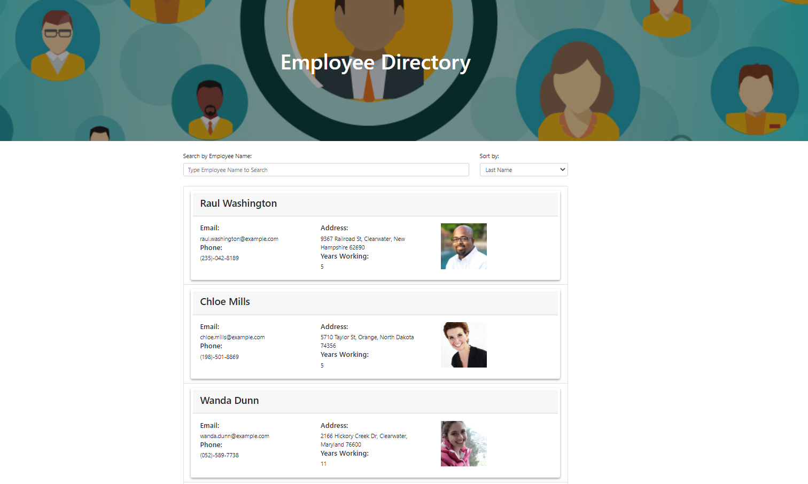

# Employee Directory

The Employee Directory app allows the user to search through the employee directory and Sort the results.  

The web app has been developed in node.js using React, also a third-party API is used to get the employee's information and a framework as Bootstrap for styling purposes.

[Click here to go to the live site](https://chernanma.github.io/Employee-Directory/)

---

## User Story

* As a user, I want to be able to view my entire employee directory at once so that I have quick access to their information.

## Business Context

An employee or manager would benefit greatly from being able to view non-sensitive data about other employees. It would be particularly helpful to be able to filter employees by name.

---
## Technologies

- Node.js
- JQuery
- Boostrap
- React.js

---
## References

- Node.js, https://nodejs.org/en/docs/

- Bootcampspot, John Hopkins Univetsity, PWA Project 

- Bootstrap, https://getbootstrap.com/

- JQuery W3Schools, https://www.w3schools.com/jquery/

- React, https://reactjs.org/

- React App Deployment, https://create-react-app.dev/

